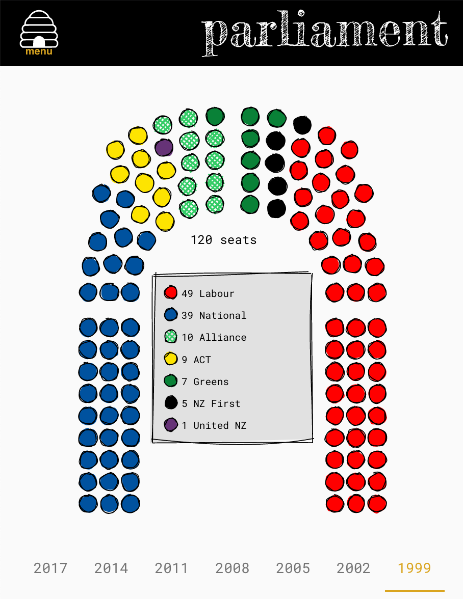

## 🦆 parliament!

this is a project to display what the nz parliament would look like, based on user-input party votes and electorates.

it also displays past results, and current polls.

 ## 🐌 run your own parliament
 
 parliament uses pnpm as a package manager
 
 [pnpm](https://pnpm.js.org/en/)
 
 to run locally:
 
 `npm i -g pnpm`
 
 `pnpm i`
 
 `pnpm run develop`
 
 to see a production build:
 
 `pnpm run build`
 
 `pnpm run serve`
 
 ## 🐞 thanks bye
